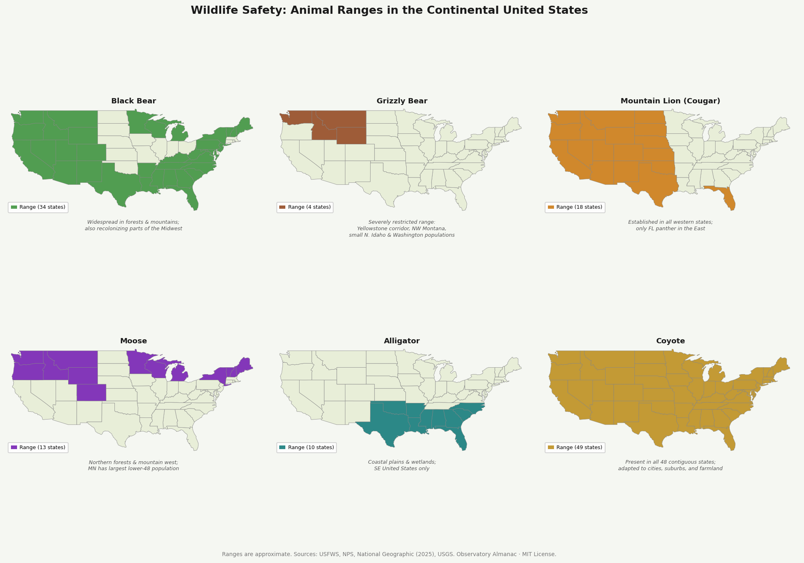
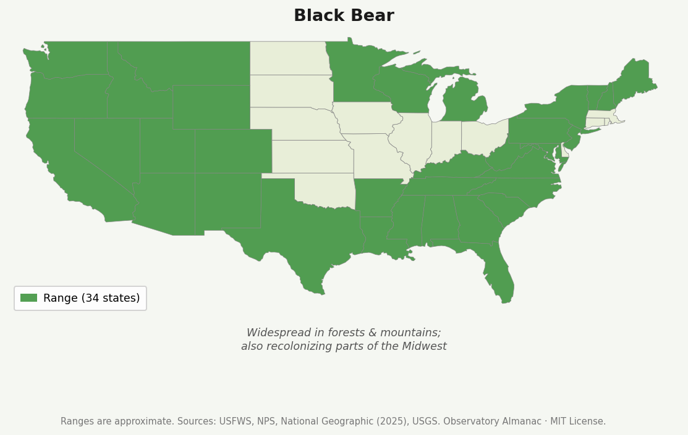
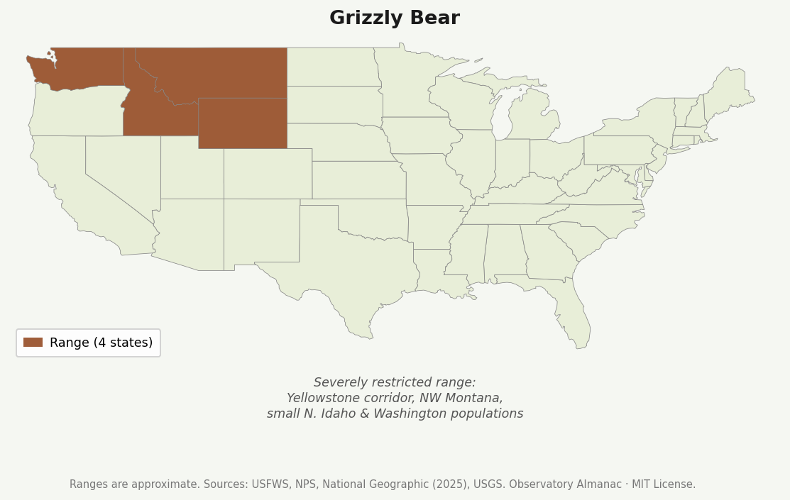
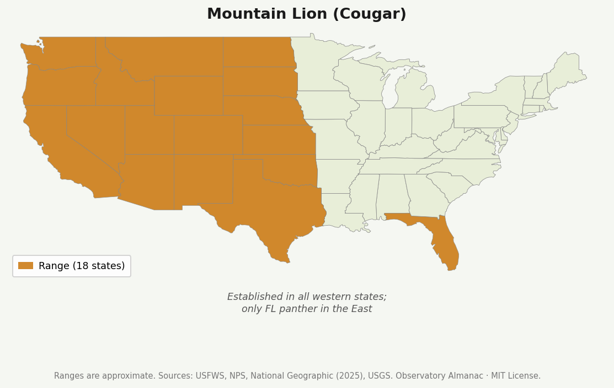
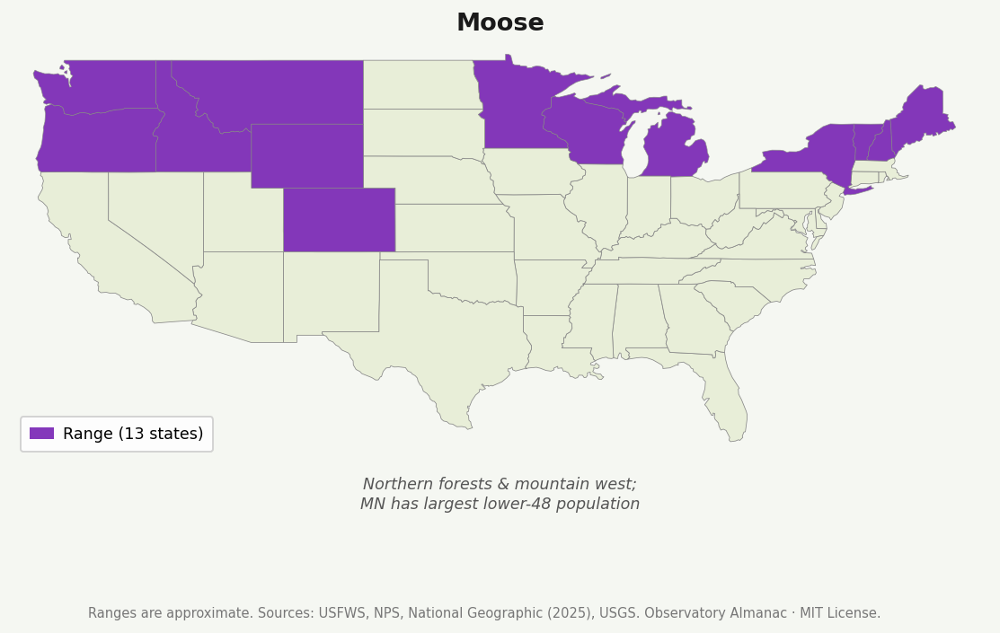
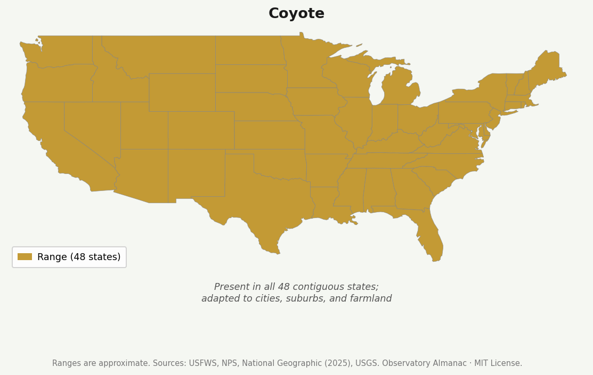
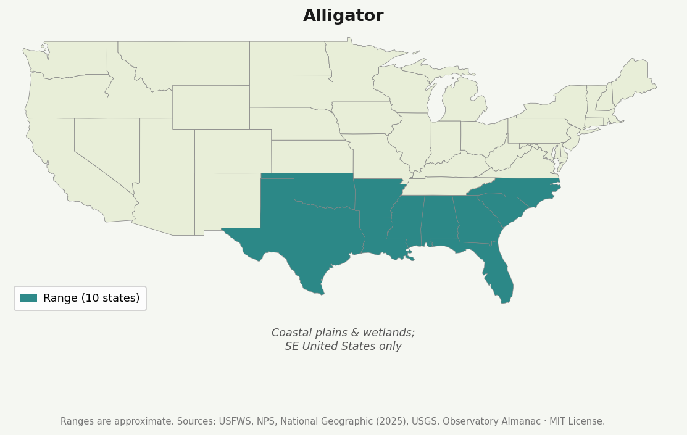

# Wildlife Safety Tips

*How to coexist safely with wild animals — what to do, and what not to do.*

> **If you are in immediate danger from wildlife, call 911. For non-emergency wildlife concerns, contact your state's fish and wildlife agency or a licensed wildlife rehabilitator.**

*Ranges are approximate. Sources: USFWS, NPS, National Geographic (2025), USGS.*

---

## General Principles

**"If your actions cause a reaction from the animal, you're too close."** — U.S. National Park Service, via *National Geographic*. If you can take a selfie with wildlife, you are definitely too close.

**Keep recommended distances:** At least 100 yards from bears, wolves, and large cats. At least 25 yards from bison, moose, elk, and other large animals. These aren't suggestions — violating them is illegal in national parks and consistently causes injuries.

**Never feed wildlife.** Feeding habituates animals to humans, erodes their natural foraging behavior, and often ends with the animal being euthanized. *"A fed bear is a dead bear"* — a phrase used by wildlife managers because food-conditioned bears have shorter lifespans and must be removed when conflict follows. The same logic applies to every wild animal. Between 2008 and 2015, 1,160 people in the US died in animal encounters — and most incidents are preventable through distance and food discipline. *(National Geographic)*

**Secure attractants.** Bird feeders, outdoor pet food, compost, fruit trees, garbage cans — all draw wildlife in. Manage them and you reduce encounters at the source.

**Teach children:** *Look with your eyes, not your hands.* Never run from a predator — it triggers a chase response.

**Know before you go.** Research what animals live in the area you're visiting. Behaviors that are safe around one species can be fatal around another.

---

## Bears

**Species:** Black bear (eastern US, parts of west); Grizzly/Brown bear (Alaska, Yellowstone, northwest Montana, northwest Wyoming, Idaho).

*Black bear range — 34 states. Widespread in forests and mountains; also recolonizing parts of the Midwest.*

*Grizzly bear range — 4 states. Severely restricted: Yellowstone corridor, NW Montana, small populations in N. Idaho and Washington.*

### Prevention
- Make noise while hiking — talk, clap, use bear bells. Bears that are startled are more dangerous than bears that hear you coming.
- Store food, cooking equipment, and scented products in bear-resistant containers or a car trunk — never in a tent. Cook 200 feet from where you sleep.
- Secure trash. Do not leave pet food outside overnight. Remove bird feeders when bears are active (spring through fall).
- Avoid berry bushes and other natural food sources when in bear country.
- Never place yourself between a mother and her young.

### Encounter — Black Bear
- **Stay calm.** Most black bears are curious, not aggressive.
- Speak in a calm, firm voice. Identify yourself as human. Wave your arms slowly to appear large.
- Back away slowly; do not run; do not climb a tree (black bears climb well).
- If a black bear makes contact: **fight back.** Target the nose and eyes. Black bear attacks are almost always predatory or defensive — playing dead is not effective.

### Encounter — Grizzly Bear
- **Carry bear spray** in grizzly country. Know how to use it before you need it: available within 3 seconds, deployed in a cloud at 30–60 feet toward an oncoming bear.
- Do not run or climb a tree (grizzlies also climb).
- If a grizzly charges and makes contact: **play dead.** Lie flat on your stomach, hands clasped behind neck, legs spread. Leave your backpack on if you have one — it protects your back. Stay still until the bear leaves.
- If a grizzly attacks you in your tent at night (rare, predatory): **fight back aggressively.**

---

## Mountain Lions (Cougars)

**Range:** Western US, small populations in Florida (Florida panther).

*Mountain lion range — 18 states. Established across the west; Florida panther is the only eastern population.*

### Prevention
- Hike with others; avoid hiking at dawn, dusk, or night.
- Keep children and dogs close and leashed. Watch for claw marks and scat on trails.
- Choose campsites away from rock overhangs, cliffs, and thick brush.

### Encounter
- **Stop. Do not run.** Running activates predatory instinct — big cats can always outrun a human.
- Face the animal. **Make yourself look as large as possible** — raise arms slowly, open your jacket over your head. If you have an umbrella, quickly open and close it while facing the cougar.
- Clap loudly, shout, and take two quick steps toward the animal to send it running. Keep eye contact; do not look away.
- If the lion moves closer: **throw objects** — rocks, water bottles — directly at it.
- If attacked: **fight back forcefully.** Target eyes and throat. Mountain lion attacks met with vigorous resistance are often abandoned. *(National Geographic / Panthera puma program)*

---

## Bison and Moose

Often overlooked in favor of predators — but statistically among the most dangerous animals in North America.

*Moose range — 13 states. Northern forests and mountain west; Minnesota has the largest lower-48 population.*

### Bison
**Range:** Primarily Yellowstone and other Great Plains reserves; reintroduced populations across the west.

- Bison look slow but can run **up to 35 mph** and change direction faster than a horse. They are unpredictable and can charge without warning.
- Stay at least **100 yards away** at all times. More Yellowstone injuries are caused by bison than bears.
- If charged: put a large solid object (car, tree, rock) between you and the animal. Do not try to outrun it.
- Never approach bison for photographs — this is the most common trigger for attacks in national parks.

### Moose
**Range:** Alaska, Canada, Rocky Mountains, New England.

- In Alaska, **more people are injured by moose than bears each year.** *(National Geographic)*
- A moose that pins its ears back, raises the hair on its neck, licks its snout, or lowers its head is about to charge.
- If charged: **run** (unlike predators, running from a moose is appropriate) and get behind a large tree or solid barrier.
- A moose will typically stop and leave once it no longer feels threatened. Do not approach again.
- Cow moose with calves and bulls in rut (September–October) are especially dangerous.

---

## Coyotes

**Range:** All of North America; now thriving in cities and suburbs.

*Coyote range — 48 contiguous states. Present everywhere; adapted to cities, suburbs, and farmland.*

### Prevention
- Never intentionally feed coyotes.
- Feed pets indoors. Small pets are at risk, especially at dawn, dusk, and night.
- Supervise small children when coyotes are known to be in the area.

### Encounter
- **Haze the coyote** — make noise, wave arms, throw objects toward (not at) it. The goal is to reinforce their natural fear of humans.
- Do not run; do not turn your back.
- A coyote showing no fear of humans has likely been fed. Report to local animal control.

---

## Alligators

**Range:** South Carolina to Florida to Texas.

*Alligator range — 10 states. Coastal plains and wetlands of the Southeast.*

- Alligators can reach 15 feet and weigh around 1,000 pounds. They are most dangerous **in or near water**.
- Stay 10–15 feet away on dry ground; avoid the water's edge entirely. Do not splash at the water's edge.
- **Do not swim with pets** — dogs and cats are ideal prey size for alligators. Keep pets away from water where alligators have been spotted.
- Avoid swimming at night — alligators are most active after dark.
- Never feed alligators. It is illegal and leads directly to attacks.

### If Attacked
- **Fight back.** Poke at the eyes, hit on the head. Try to cause the alligator to release and reposition — use that moment to flee.
- Run in a **straight line** as fast as possible. Despite their bulk, alligators can sprint up to 35 mph on land over short distances.

---

## Venomous Snakes

**Common North American venomous species:** Rattlesnakes (many species), Copperhead, Cottonmouth (Water Moccasin), Coral Snake.

### Prevention
- Watch where you step, especially on rocks, logs, and in tall grass.
- Use a flashlight at night in snake country.
- Do not reach into dark spaces or piles of wood, rocks, or brush.
- Wear long pants and closed shoes in snake habitat.

### Encounter
- **Freeze, then back away slowly.** Most snakebites occur when someone steps on a snake or tries to handle or kill it.
- A coiled or defensive snake is asking for space — not necessarily about to strike.
- Snakes have a strike range of roughly half their body length.

### If Bitten
1. Move away from the snake. Stay calm — elevated heart rate spreads venom faster.
2. Remove rings, watches, and tight clothing near the bite — swelling will follow.
3. Keep the bitten limb below heart level.
4. **Call 911 or get to an emergency room immediately.** The only effective treatment is antivenom.
5. **Do not:** cut and suck the wound, apply ice, apply a tourniquet, or use electric shock. These cause additional harm.
6. Photograph the snake from a distance if possible — it helps with treatment. Do not attempt to capture or kill it.

---

## Bats

**When they matter:** Bats are the primary source of rabies exposure in North America. Bat teeth are small — a bite may not be felt.

### If a Bat Is in Your Home
- Do not release it until you determine whether exposure occurred.
- If anyone was sleeping in a room with a bat and cannot confirm they were not bitten (children, heavily sleeping adults, intoxicated individuals), **contact your local health department immediately.** Rabies PEP is highly effective when started promptly.
- To catch a bat: wear heavy leather gloves, wait for it to land, place a container over it, slide cardboard under, secure. Contact animal control.
- **Never handle a bat with bare hands.**

---

## Raccoons, Foxes, and Skunks

The most common rabies vectors after bats.

**Signs of rabies:** Unusual daytime activity, stumbling, self-mutilation, unprovoked aggression, no attempt to flee.

- **Never approach or handle any wild mammal behaving abnormally.** Call animal control.
- If bitten or scratched: wash the wound immediately with soap and water for 5 minutes. Contact a healthcare provider and local health department. Do not wait to see if symptoms develop — rabies is nearly always fatal once symptomatic.

### Skunk Spray
- **To neutralize:** Mix 1 quart 3% hydrogen peroxide + ¼ cup baking soda + 1 teaspoon dish soap. Work into wet coat/skin, leave 5 minutes, rinse. Do not store — the mixture generates gas.
- Tomato juice masks odor; it does not neutralize it.

---

## Small Mammals and Squirrels

Often underestimated. At the Grand Canyon, **squirrel bites are the #1 reason visitors end up at the medical clinic** — caused almost entirely by feeding. *(National Geographic / U.S. National Park Service)*

- It is illegal to feed any wildlife in national parks — no matter the size, no matter how harmless they appear.
- Even small mammals can carry plague, tularemia, and rabies.
- If bitten by any small mammal: wash thoroughly with soap and water and seek medical attention.

---

## Ticks

**Risk:** Lyme disease, Rocky Mountain spotted fever, anaplasmosis, ehrlichiosis, and others.

### Prevention
- Use EPA-registered insect repellents (DEET, picaridin, permethrin on clothing).
- Wear long pants tucked into socks in tall grass and woodland.
- Do a full-body tick check after any time outdoors — scalp, ears, armpits, groin, behind knees.

### Removing an Attached Tick
1. Use fine-tipped tweezers. Grasp as close to the skin as possible.
2. Pull upward with steady, even pressure. Do not twist or jerk.
3. Clean the bite with rubbing alcohol or soap and water.
4. Dispose in alcohol, a sealed bag, or flushed down the toilet.
5. **Do not** use petroleum jelly, a hot match, or nail polish — these cause the tick to regurgitate into the wound.
6. Monitor for rash or fever for 30 days. Consult a doctor if symptoms develop.

---

## Wasps, Yellowjackets, and Hornets

### Prevention
- Cover food and drinks outdoors; empty trash cans frequently.
- Avoid strong perfume or floral scents.
- Check before sitting — many species nest in ground holes.

### Encounter
- Move away calmly. Do not swat.
- If swarmed: run in a straight line, cover your face, get inside or into a vehicle.
- **If you have a known sting allergy:** carry an EpiPen and wear a medical alert bracelet.

### Anaphylaxis Signs
Hives, swelling of face or throat, difficulty breathing, dizziness, rapid pulse. **Call 911.** Use epinephrine immediately. Lie down with legs elevated unless breathing is difficult.

---

## Quick Reference

| Animal | Do | Don't |
|--------|-----|-------|
| Bear | Make noise; carry bear spray (grizzly); fight back (black bear) | Run, feed, approach cubs |
| Mountain lion | Make yourself large; fight back | Run, crouch, turn your back |
| Bison/Moose | Stay 100 yards away; get behind solid cover if charged | Approach for photos, run from bison |
| Alligator | Stay back from water; fight back if attacked | Feed, swim at night, walk pets near water |
| Coyote | Haze it; secure pets | Feed, leave food out |
| Venomous snake | Back away; call 911 if bitten | Handle, cut, apply ice |
| Bat in home | Contact health dept. if exposure possible | Handle without gloves |
| Squirrel/small mammal | Never feed; seek care if bitten | Feed or handle |
| Sick mammal | Call animal control | Approach or handle |
| Tick | Remove with tweezers; monitor for illness | Squeeze, burn, use petroleum jelly |

---

## Sources

- National Geographic, *[How to stay safe around wild animals](https://www.nationalgeographic.com/animals/article/safety-animals-wildlife-attacks-national-parks)* (2021)
- National Geographic, *[How to survive an encounter with wildlife — from bears to bison](https://www.nationalgeographic.com/animals/article/survive-wildlife-encounters-bear-bison-shark-alligator)* (2023)
- U.S. National Park Service — [Bear Safety](https://www.nps.gov/subjects/bears/safety.htm)
- ASPCA Animal Poison Control Center: 888-426-4435

---

*Observatory Almanac. Licensed [MIT](https://opensource.org/licenses/MIT).*
